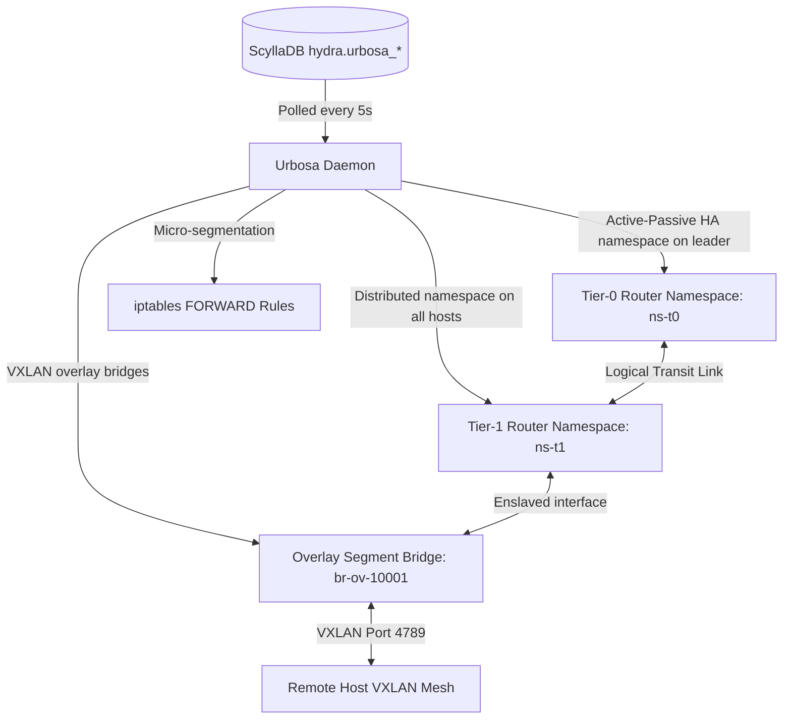

# Urbosa (Software-Defined Overlay Routing & Micro-segmentation Daemon)

**Urbosa** is the host-level L3 software-defined networking (SDN) controller and overlay coordinator for the hypervisor hosts. It is the direct equivalent of VMware **NSX** (which manages logical routers, overlay segments, and distributed micro-segmentation firewalls).

> [!NOTE]
> **Name Origin:** Named after **Urbosa**, the Gerudo Champion from *The Legend of Zelda: Breath of the Wild* who wields the power of lightning and high-speed electrical currents. This matches the fast-flowing overlay VXLAN tunnels and high-performance logical packet routing of the cluster.

---

## 1. System Architecture

Urbosa runs as a native Python daemon (`urbosa.service`) on every hypervisor host. It orchestrates virtual Layer-3 networks using Linux network namespaces and VXLAN tunnels.



### A. Tier-0 (T0) Logical Router (North-South Edge Gateway)
* **High Availability Mode:** Runs in **Active-Passive HA** within a dedicated namespace (`ns-t0-<id>`) on the active cluster leader node (holding the cluster VIP).
* **External Connectivity:** Binds external physical uplink interfaces (e.g. `ens192`), configures static uplink IPs/gateways, and executes Source NAT (Masquerading) or DNAT (port-forwarding) rules to route traffic between the cluster overlays and the external physical network.

### B. Tier-1 (T1) Logical Router (Distributed East-West Router)
* **Distributed Routing:** Spawns a local namespace (`ns-t1-<id>`) on all hypervisor hosts.
* **Local Routing:** VMs on different overlay segments attached to the same T1 router have their packets routed locally inside the host's kernel namespace without egressing to physical switches.
* **Integrated DHCP/IPAM:** Spawns a lightweight `dnsmasq` instance inside the namespace to distribute IP leases dynamically on defined segments.

### C. Overlay Segments (VXLAN Tunnels)
* **Overlay Isolation:** Creates logical bridges `br-ov-<vni>` and pairs them with static point-to-multipoint VXLAN interfaces (`vxlan-<vni>`) targeting the IPs of peer cluster hosts. This forms a full-mesh overlay fabric on UDP port `4789` without requiring physical multicast configurations.

### D. Distributed Firewall (Micro-segmentation)
* **Stateful Security:** Installs iptables rule sets in the `FORWARD` chain of the host namespace, enforcing stateful `ALLOW` or `DROP` policies based on IP CIDRs, protocols, and destination ports.

---

## 2. Component Interactions & Database Schema

### A. Database Schema
Urbosa configurations are stored in the `hydra` keyspace across four primary tables:

```sql
-- Tier-0 Edge Routers
CREATE TABLE IF NOT EXISTS hydra.urbosa_t0_routers (
    router_id uuid PRIMARY KEY,
    name text,
    uplink_interface text,
    uplink_ip text,
    gateway_ip text,
    nat_rules text  -- JSON string of SNAT/DNAT rules
);

-- Tier-1 Distributed Routers
CREATE TABLE IF NOT EXISTS hydra.urbosa_t1_routers (
    router_id uuid PRIMARY KEY,
    name text,
    t0_link_id uuid,  -- Link to parent T0 router
    dhcp_enabled boolean
);

-- Overlay Segments
CREATE TABLE IF NOT EXISTS hydra.urbosa_segments (
    segment_id uuid PRIMARY KEY,
    name text,
    vni int,           -- VXLAN VNI (e.g. 10001, 10002)
    t1_link_id uuid,   -- Link to parent T1 router
    subnet_cidr text,  -- CIDR block (e.g. 10.0.1.0/24)
    gateway_ip text
);

-- Distributed Firewall Rules
CREATE TABLE IF NOT EXISTS hydra.urbosa_firewall_rules (
    rule_id uuid PRIMARY KEY,
    description text,
    source_ip text,
    dest_ip text,
    protocol text,     -- TCP, UDP, ICMP, ANY
    port int,
    action text,       -- ALLOW, DENY
    priority int
);
```

### B. Synchronization Loop
Every 5 seconds, the `urbosa` daemon performs the following:
1. **Settings Verification:** Reads the `urbosa_enabled` settings key from `hydra.cluster_settings`. If disabled, it stays idle.
2. **Leader Detection:** Detects leadership by checking if the cluster VIP is bound to a local network interface.
3. **T0 Reconcile:** If the leader node, configures namespaces and external interfaces. Passive nodes clean up the namespaces to prevent IP conflicts.
4. **T1 Reconcile:** Sets up local distributed namespaces and spawns DHCP daemons where configured.
5. **VXLAN Overlay Sync:** Builds bridges and configures VXLAN point-to-multipoint interfaces for all active VNIs.
6. **Firewall Sync:** Instantiates host-level forwarding filter rules.

---

## 3. Command Examples & Syntax

### A. Managing the Urbosa Service
Monitor and control the status of the sync daemon on hypervisors:
```bash
# Check service status
systemctl status urbosa

# View log outputs and execution reports
journalctl -u urbosa -n 50 --no-pager

# Restart the service
systemctl restart urbosa
```

### B. Logical Router & Interface Diagnostics
Investigate the namespace structures and interfaces created by Urbosa:
```bash
# List all active network namespaces
ip netns list

# Run command inside a Tier-1 distributed router namespace
ip netns exec ns-t1-da7a3f4e ip address show
ip netns exec ns-t1-da7a3f4e route -n

# Check DHCP lease records inside a T1 namespace
ip netns exec ns-t1-da7a3f4e ps aux | grep dnsmasq

# Trace VXLAN bridge memberships
ip link show type bridge
bridge fdb show dev vxlan-10001
```

### C. Firewall Rule Verification
Query active micro-segmentation rules on a hypervisor host:
```bash
# List all iptables forward filtering rules
iptables -L FORWARD -n -v --line-numbers
```
