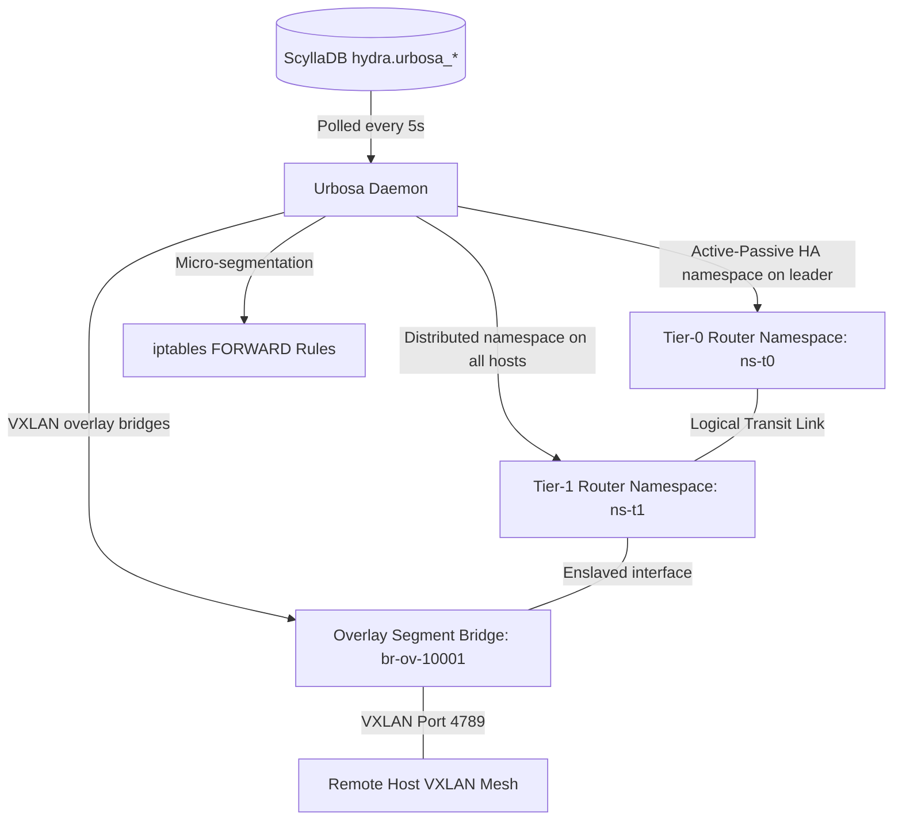

# Urbosa (Software-Defined Overlay Routing & Micro-segmentation Daemon)

**Urbosa** is the host-level L3 software-defined networking (SDN) controller and overlay coordinator for the hypervisor hosts. It is the direct equivalent of VMware **NSX** (which manages logical routers, overlay segments, and distributed micro-segmentation firewalls).

> [!NOTE]
> **Name Origin:** Named after **Urbosa**, the Gerudo Champion from *The Legend of Zelda: Breath of the Wild* who wields the power of lightning and high-speed electrical currents. This matches the fast-flowing overlay VXLAN tunnels and high-performance logical packet routing of the cluster.

---

## 1. System Architecture

Urbosa runs as a native Python daemon (`urbosa.service`) on every hypervisor host. It orchestrates virtual Layer-3 networks using Linux network namespaces and VXLAN tunnels.


```mermaid
graph TD
    DB[(ScyllaDB hydra.urbosa_*)] -->|Polled every 5s| Urbosa[Urbosa Daemon]
    Urbosa -->|Active-Passive HA namespace on leader| T0[Tier-0 Router Namespace: ns-t0]
    Urbosa -->|Distributed namespace on all hosts| T1[Tier-1 Router Namespace: ns-t1]
    Urbosa -->|VXLAN overlay bridges| Seg[Overlay Segment Bridge: br-ov-10001]
    Urbosa -->|Micro-segmentation| DFW[iptables FORWARD Rules]

    T0 ---|Logical Transit Link| T1
    T1 ---|Enslaved interface| Seg
    Seg ---|VXLAN Port 4789| RemoteHost[Remote Host VXLAN Mesh]
```

### A. Tier-0 (T0) Logical Router (North-South Edge Gateway)
* **High Availability Mode:** Runs in **Active-Passive HA** within a dedicated namespace (`ns-t0-<id>`) on the active cluster leader node (holding the cluster VIP).
* **External Connectivity:** Binds external physical uplink interfaces (e.g. `ens192`), configures static uplink IPs/gateways, and executes Source NAT (Masquerading) or DNAT (port-forwarding) rules to route traffic between the cluster overlays and the external physical network.

### B. Tier-1 (T1) Logical Router (Distributed East-West Router)
* **Distributed Routing:** Spawns a local namespace (`ns-t1-<id>`) on all hypervisor hosts.
* **Local Routing:** VMs on different overlay segments attached to the same T1 router have their packets routed locally inside the host's kernel namespace without egressing to physical switches.
* **Integrated DHCP/IPAM:** Spawns a lightweight `dnsmasq` instance inside the namespace to distribute IP leases dynamically on defined segments.
* **Transit Link Addressing:** Each T1 reaches its parent T0 over a `/30` carved out of `100.64.0.0/16`. The `/30` is **allocated from a recorded pool** (`hydra.urbosa_transit_pool`), claimed with a lightweight transaction keyed on the slot number, and released when the router is deleted. It used to be derived as `md5(router_id)[:4] % 16384`, which handed two routers whose hashes collided the *same* two addresses on both links — the T0 then had routes to two tenants' subnets pointing at one next hop, and delivered one tenant's return traffic into the other's namespace. With 16384 slots the first collision is expected at roughly 150 routers, and nothing checked. The hashed value is still used as the *preferred* slot, so an existing cluster keeps its current transit addressing wherever that slot is free and only the colliding minority move. If the pool cannot be read, transit links are left exactly as they are rather than falling back to the derived value.

### C. Overlay Segments (VXLAN Tunnels)
* **Overlay Isolation:** Creates logical bridges `br-ov-<vni>` and pairs them with static point-to-multipoint VXLAN interfaces (`vxlan-<vni>`) targeting the IPs of peer cluster hosts. This forms a full-mesh overlay fabric on UDP port `4789` without requiring physical multicast configurations.
* **VM Network Integration:** When a VM is configured with an Urbosa overlay segment network ID, Vali automatically interfaces the VM's network interface with the corresponding `br-ov-{vni}` bridge on the host, granting the VM access to the software-defined overlay network.
* **Head-End Replication:** Broadcast, unknown-unicast and multicast frames are replicated by the sending host to every peer, using one static FDB entry per peer against the all-zero MAC. This is a deliberate choice, not an oversight — see [Head-End Replication](#5-head-end-replication) below. Flood entries for hosts that have *left* `hydra.nodes` are withdrawn by the reclaimer; learned unicast entries are never touched.

### D. Distributed Firewall (Micro-segmentation)
* **Stateful Security:** Installs iptables rule sets into a dedicated `URBOSA-FWD` chain in the host namespace, reached by a single jump from `FORWARD`, enforcing stateful `ALLOW` or `DROP` policies based on IP CIDRs, protocols, and destination ports. The chain is flushed and rebuilt from the database on every pass through a single atomic `iptables-restore` transaction, so a rule deleted from the database is actually withdrawn from the host — appending directly to `FORWARD` left deleted rules in place forever. Rules are ordered by `(priority, rule_id)`, matching the ascending `priority` sort the WebUI already applies, so every node derives an identical chain from the same ruleset. All rule fields are validated (CIDRs parsed, protocol allowlisted, port range-checked) before anything is applied; invalid rules are skipped and logged, never executed. A failed or partial database read skips the rebuild entirely rather than flushing the chain against incomplete data.

### E. Resource Reclamation
Deleting a router or a segment from the database used to delete nothing from the host. The namespace kept routing, the bridge kept forwarding, the tunnel kept carrying the VNI — a segment an operator removed for a reason went on passing traffic until the machine was rebooted, and a long-lived cluster only ever accumulated kernel objects.

Urbosa now reclaims what it created, under three rules that exist because the *cure* is the more dangerous half:

1. **Nothing is reclaimed unless the desired state read cleanly and in full.** A failed query returns "unreadable", never an empty list. A database blip arriving as "the operator deleted everything" would tear the NIC out of every running VM on the host.
2. **Only names Urbosa generates are candidates, matched whole.** `ns-t0-<8 hex>`, `ns-t1-<8 hex>`, `br-ov-<vni>`, `vxlan-<vni>`, `veth-ov-<vni>`, `t0-/t1-<8 hex>`, `mv-t0-<8 hex>`. A namespace or device that does not match is not Urbosa's and is never touched, whatever it is.
3. **A candidate must be provably idle**, and anything that cannot be read counts as busy. Urbosa refuses, loudly and once, rather than guessing.

| Resource | Reclaimed when | Refused when |
| :--- | :--- | :--- |
| `br-ov-<vni>` bridge | no segment with that VNI exists | anything other than its own `vxlan-`/`veth-ov-` is enslaved (guest taps); it carries a globally scoped host address; its ports or addresses cannot be listed; it is not actually a bridge |
| `vxlan-<vni>` tunnel | as above | its bridge was refused, so the bridge is still forwarding over it |
| `veth-ov-<vni>` | as above, **or** the segment was re-attached to a different T1 (the pair is rebuilt against the right namespace on the next pass) | its bridge was refused |
| `ns-t1-<id>` / `ns-t0-<id>` | no matching router row; a `ns-t0-` on any host that does not hold the VIP | it holds the gateway interface of a segment that still exists; it holds an interface Urbosa did not create; a process Urbosa did not start is running inside it; either list could not be read |
| `dnsmasq` inside a live T1 | nothing in the database asks for DHCP on that interface any more | — |
| `t0-`/`t1-<id>` veth in the root namespace | always — both ends are moved into namespaces in the same breath they are created, so a root-namespace half is wreckage from an interrupted pass | — |
| VXLAN flood entry | its destination is not a member of `hydra.nodes` | the node list could not be read, or came back empty |
| T0 return route | no segment behind that transit link uses the prefix any more | the full set of transit addresses could not be computed |
| Transit `/30` reservation | its Tier-1 router no longer exists (released conditionally, from the VIP holder only) | — |

Namespace deletion kills the processes inside it first: `ip netns del` unlinks the *name* and stops nothing, so a surviving `dnsmasq` keeps the namespace and its interfaces alive with no name left to reach them by.

Two settings control it, both read from `hydra.cluster_settings` each pass:

| Key | Default | Effect |
| :--- | :--- | :--- |
| `urbosa_gc_enabled` | `true` (absent = enabled) | `false` switches reclamation off entirely; the leak returns. |
| `urbosa_gc_dry_run` | `false` | `true` keeps reporting what would be removed without removing it. |

---

## 2. Component Interactions & Database Schema

### A. Database Schema
Urbosa configurations are stored in the `hydra` keyspace across five tables — four of configuration, and one of allocation state that Urbosa maintains itself:

```sql
-- Tier-0 Edge Routers
CREATE TABLE IF NOT EXISTS hydra.urbosa_t0_routers (
    router_id uuid PRIMARY KEY,
    name text,
    uplink_interface text,
    uplink_ip text,
    gateway_ip text,
    nat_rules text  -- JSON string of SNAT/DNAT rules
);

-- Tier-1 Distributed Routers
CREATE TABLE IF NOT EXISTS hydra.urbosa_t1_routers (
    router_id uuid PRIMARY KEY,
    name text,
    t0_link_id uuid,  -- Link to parent T0 router
    dhcp_enabled boolean
);

-- Overlay Segments
CREATE TABLE IF NOT EXISTS hydra.urbosa_segments (
    segment_id uuid PRIMARY KEY,
    name text,
    vni int,           -- VXLAN VNI (e.g. 10001, 10002)
    t1_link_id uuid,   -- Link to parent T1 router
    subnet_cidr text,  -- CIDR block (e.g. 10.0.1.0/24)
    gateway_ip text,
    dhcp_enabled boolean,
    dhcp_start text,
    dhcp_end text
);

-- Distributed Firewall Rules
CREATE TABLE IF NOT EXISTS hydra.urbosa_firewall_rules (
    rule_id uuid PRIMARY KEY,
    description text,
    source_ip text,
    dest_ip text,
    protocol text,     -- TCP, UDP, ICMP, ANY
    port int,
    action text,       -- ALLOW, DENY
    priority int
);

-- Transit /30 pool: one row per allocated slot out of 100.64.0.0/16.
-- Keyed on the SLOT, so `INSERT ... IF NOT EXISTS` resolves two claimants
-- racing for the same subnet. router_id is text and allocated_at_ms is
-- bigint rather than uuid and timestamp: a refused lightweight transaction
-- returns the whole winning row, and Daruk cannot serialise driver UUID or
-- datetime objects -- so the one response that says who won the slot would be
-- the one response no caller could read. hydra.cluster_locks carries the same
-- scar for the same reason.
CREATE TABLE IF NOT EXISTS hydra.urbosa_transit_pool (
    subnet_index int PRIMARY KEY,   -- 0 .. 16383; slot N is 100.64.(N>>6).((N&63)*4)/30
    router_id text,                 -- the Tier-1 router holding it
    node_id text,                   -- the host that made the claim
    allocated_at_ms bigint
);
```

### B. Synchronization Loop
Every 15 seconds, the `urbosa` daemon performs the following:
1. **Settings Verification:** Reads the `urbosa_enabled` settings key from `hydra.cluster_settings`. If disabled, it stays idle.
2. **Desired State Read:** Reads the T0, T1 and segment tables. If *any* of them cannot be read — a failed query, or a row that looks like JSON and does not parse — the whole pass is skipped and every host resource is left exactly as it is. Reconciling against half a topology rebuilds things that were deleted; reclaiming against it deletes things that were not.
3. **Leader Detection:** Detects leadership by checking if the cluster VIP is bound to a local network interface, compared address by address rather than by substring.
4. **Transit Allocation:** Claims a `/30` slot from `hydra.urbosa_transit_pool` for each T1 router that links to a T0. A router that cannot be given a slot has its transit link left untouched for this pass.
5. **T0 Reconcile:** If the leader node, configures namespaces and external interfaces. Passive nodes clean up the namespaces to prevent IP conflicts.
6. **T1 Reconcile:** Sets up local distributed namespaces, spawns DHCP daemons where configured, and installs the transit link and return routes.
7. **VXLAN Overlay Sync:** Builds bridges and configures VXLAN point-to-multipoint interfaces for all active VNIs.
8. **Firewall Sync:** Instantiates host-level forwarding filter rules.
9. **Reclamation:** Removes host resources whose database rows are gone, subject to the rules in §1.E. Runs last, so reconciliation has already had its chance to recreate anything it wants.

---

## 3. Command Examples & Syntax

### A. Managing the Urbosa Service
Monitor and control the status of the sync daemon on hypervisors:
```bash
# Check service status
systemctl status urbosa

# View log outputs and execution reports
journalctl -u urbosa -n 50 --no-pager

# Restart the service
systemctl restart urbosa
```

### B. Logical Router & Interface Diagnostics
Investigate the namespace structures and interfaces created by Urbosa:
```bash
# List all active network namespaces
ip netns list

# Run command inside a Tier-1 distributed router namespace
ip netns exec ns-t1-da7a3f4e ip address show
ip netns exec ns-t1-da7a3f4e route -n

# Check DHCP lease records inside a T1 namespace
ip netns exec ns-t1-da7a3f4e ps aux | grep dnsmasq

# Trace VXLAN bridge memberships
ip link show type bridge
bridge fdb show dev vxlan-10001
```

### C. Firewall Rule Verification
Query active micro-segmentation rules on a hypervisor host:
```bash
# List Urbosa's managed firewall rules (and the jump installed from FORWARD)
iptables -L URBOSA-FWD -n -v --line-numbers
iptables -L FORWARD -n -v --line-numbers
```

### D. Reclamation Report
The reclaimer can be run by hand on any host. It is safe to run while the daemon is running, and **reports without removing anything unless `--apply` is given**:

```bash
# What would be removed on this host, and what is being refused and why
urbosa --reclaim

# Actually remove it
urbosa --reclaim --apply
```

Sample output from a host whose segment rows had been deleted, with one bridge still carrying a VM:
```
Urbosa reclaim: REFUSING to remove bridge br-ov-19998: it still has vnet99 enslaved;
  live VM interfaces are attached, detach them before removing this segment.
Urbosa reclaim (dry run): would remove bridge br-ov-19999 - no segment with VNI 19999
  exists in hydra.urbosa_segments.
    ip link set br-ov-19999 down
    ip link delete br-ov-19999
Urbosa reclaim: 6 resource(s) would be removed. Re-run with --apply to remove them.
```

Reading the refusals matters as much as reading the removals: a refusal is Urbosa saying it found something it did not put there.

### E. Transit Pool Inspection
```bash
# Who holds which /30. Slot N is 100.64.(N>>6).((N&63)*4)/30
valcli db.query "SELECT * FROM hydra.urbosa_transit_pool;"
```

---

## 4. User Interface Layouts

To ensure optimal usability on horizontal widescreen monitors and eliminate vertical scrollbars, the Urbosa SDN console uses expanded landscape-oriented modal designs:
* **Modal Forms Dimension:** Creation and modification modals for Tier-0 Gateways, Tier-1 Routers, Overlay Segments, and Distributed Firewall Rules use a widescreen landscape overlay panel (`width: 1050px; max-width: 95vw; max-height: 95vh;`).
* **Grid Formatting (3-Column Layout):** Form inputs are arranged in a clean, three-column grid (`display: grid; grid-template-columns: 1fr 1fr 1fr; gap: 20px;`) with elegant dividing borders:
  * **Tier-0 Modals**: Segmented into Identification (Col 1), IP/NAT Settings (Col 2), and BGP Peering (Col 3).
  * **Tier-1 Modals**: Arranged side-by-side with Name (Col 1), Parent T0 Select (Col 2), and DHCP Settings (Col 3).
  * **Subnet (Segment) Modals**: Structured as Subnet/VNI info (Col 1), Backing Router (Col 2), and DHCP Ranges (Col 3).
* **Scrollbar Elimination**: Increased modal viewport boundaries guarantee that forms fit on standard horizontal screens without scrollbar clipping.
* **Full Segment Customization**: In the Overlay Segments edit modal, all attributes (Segment Name, VXLAN VNI, attached Tier-1 router link, subnet CIDR, Gateway IP, and DHCP IPAM lease ranges) are fully editable.

---

## 5. Head-End Replication

Every host replicates each broadcast, unknown-unicast or multicast frame once per peer, out of a static FDB flood list:

```
00:00:00:00:00:00 dst 10.10.102.42 self permanent
00:00:00:00:00:00 dst 10.10.102.43 self permanent
```

That is O(N) packets per flooded frame per host. **This is the right design for the environments Helios targets, and it is deliberately being kept.** The reasoning, recorded so it is not re-litigated:

* **The alternative that removes the replication is multicast**, a VXLAN group instead of a peer list. It requires IGMP snooping and PIM on the physical fabric. That is unavailable on most of the switching Helios is deployed behind, and unavailable is not a performance trade-off — it is a cluster whose overlay does not pass traffic at all. A static mesh works on any L3 network that can carry UDP/4789.
* **The other alternative is a control plane that distributes MAC and ARP state** so that flooding stops being the way hosts find each other — EVPN, or a controller-driven FDB. That removes the *cause* of the flooding rather than the replication, which is the fix worth having. It is also a substantially larger piece of work than a flag: it needs a route-reflector role, per-host ARP suppression, and a story for what happens when the control plane is down. It is already scoped as the "Scale-Out Urbosa" add-on (FRRouting BGP EVPN).
* **The actual cost is bounded by cluster size and by what floods.** A VM's ARP for its gateway is answered by the T1 namespace on its *own* host and never reaches the tunnel. What crosses the mesh is ARP between guests on different hosts, DHCP discovers, and unknown-unicast during MAC learning — all bursty, all short-lived, all followed by learned unicast entries that are point-to-point. On the single-digit-node clusters this replication factor is single-digit.
* **What was actually leaking here was the peer list, not the replication.** A host removed from `hydra.nodes` kept its flood entry forever, so every broadcast was replicated to a machine that no longer existed — an unbounded cost that grows with cluster *churn* rather than cluster size, and the only part of this item that was a defect. The reclaimer now withdraws those entries. `bridge fdb append` was also verified to be idempotent for a given (MAC, destination) pair on the live cluster, so the entries themselves do not accumulate.

Revisit this if Helios starts targeting clusters large enough that the replication factor matters, and revisit it by building the EVPN control plane rather than by reaching for multicast.

---

## Technical Reference

For the internal code structure, class/function details, and execution flowcharts, see the [Technical Guide](./urbosa_technical.md).
