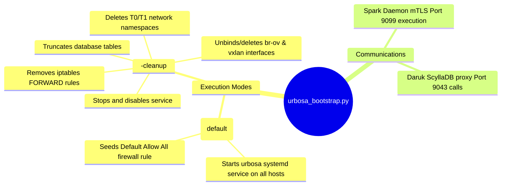

# Urbosa Bootstrap Script - Technical Documentation

This document details the internal technical structure, functions, flowcharts, and mindmaps of the network bootstrapping manager (`urbosa_bootstrap.py`).

## Technical Mindmap

## Function & Logic Breakdown

### Cleanup Mode Sequence (`--cleanup` argument)
- Retrieves active firewall rules from `hydra.urbosa_firewall_rules` database table.
- Formats dynamic shell commands using `while iptables -C FORWARD ... do iptables -D FORWARD ...` loops to clear all rules from the kernel's `FORWARD` chain.
- Loops over host IPs:
  1. Stops and disables the local `urbosa` service.
  2. Queries all active namespaces. For namespaces matching `ns-t0-` or `ns-t1-`, kills any bound processes (dnsmasq) using `ip netns pids` and deletes the namespaces.
  3. Scans interfaces using `ip -o link show`. Deletes any matching bridge devices (`br-ov-*`) or tunnels (`vxlan-*`).
  4. Runs the compiled firewall rule deletion statements.
- Wipes cluster databases:
  `TRUNCATE hydra.urbosa_t0_routers; TRUNCATE hydra.urbosa_t1_routers; TRUNCATE hydra.urbosa_segments; TRUNCATE hydra.urbosa_firewall_rules;`

### Bootstrap Mode Sequence (Default)
- Loops over hosts list, calling Spark REST API port `9099` execution:
  `systemctl enable urbosa && systemctl start urbosa`
- Checks `hydra.urbosa_t0_routers`. If empty, inserts a default "Allow All" firewall rule.
