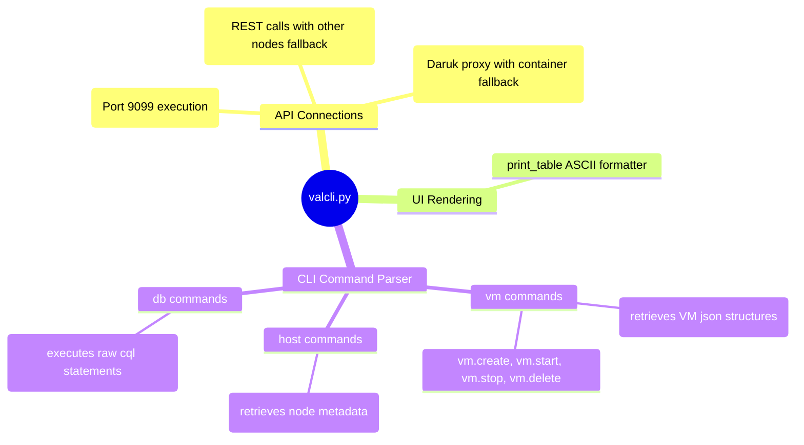

# Vali CLI Utility - Technical Documentation

This document details the internal technical structure, functions, flowcharts, and mindmaps of the VM manager CLI wrapper (`valcli.py`).

## Technical Mindmap

## Function & Logic Breakdown

### Communication Routines
- **`run_remote_spark(ip, command)`**: Submits commands to remote hosts via Spark's mTLS port `9099`.
- **`run_mtls_api(ip, path, payload, method="POST")`**: Calls local REST services. If localhost fails or throws an error, iterates over peer IPs listed in `/etc/hci/cluster.json` to retry the request (enforces cluster-wide command failover availability).
- **`run_cql_query(cql_query)`**: Communicates queries to ScyllaDB via the local Daruk proxy port `9043` or container fallback.

### Interface Formatting
- **`print_table(headers, rows)`**: Formats inputs into standard text-based ASCII borders: computes maximum widths per column, prints separating grids (`+---+`), header boundaries, and left-aligns values.

### Subcommand Handlers (`main()`)
- **`vm.list`**: Fetches registered VM records from database table `hydra.vms` and maps node IPs to human-readable hostnames.
- **`vm.create`**: Prompts/reads VM parameters, submits a POST creation payload to Vali's REST endpoints, and polls progress.
- **`vm.start` / `vm.stop` / `vm.delete`**: Submits VM task states to the Catalyst scheduler queue.
- **`host.list`**: Prints cluster nodes, statuses, and hardware information.
- **`db.query`**: Passes raw CQL arguments directly to the Cassandra database cluster.
