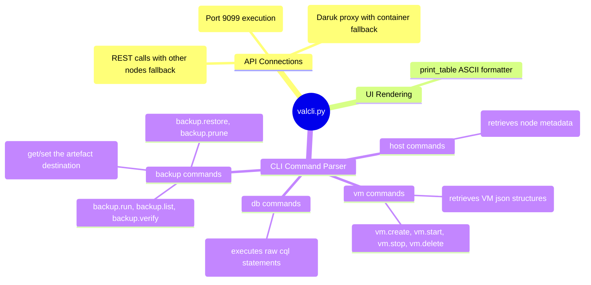

# Vali CLI Utility - Technical Documentation

This document details the internal technical structure, functions, flowcharts, and mindmaps of the VM manager CLI wrapper (`valcli.py`).

## Technical Mindmap

```mermaid
mindmap
  root((valcli.py))
    API Connections
      run_remote_spark (Port 9099 execution)
      run_mtls_api (REST calls with other nodes fallback)
      run_cql_query (Daruk proxy with container fallback)
    UI Rendering
      print_table ASCII formatter
    CLI Command Parser
      vm commands
        vm.list (retrieves VM json structures)
        vm.create, vm.start, vm.stop, vm.delete
      host commands
        host.list (retrieves node metadata)
      db commands
        db.query (executes raw cql statements)
      backup commands
        backup.target (get/set the artefact destination)
        backup.run, backup.list, backup.verify
        backup.restore, backup.prune
```

## Function & Logic Breakdown

### Communication Routines
- **`run_remote_spark(ip, command)`**: Submits commands to remote hosts via Spark's mTLS port `9099`.
- **`run_mtls_api(ip, path, payload, method="POST")`**: Calls local REST services. If localhost fails or throws an error, iterates over peer IPs listed in `/etc/hci/cluster.json` to retry the request (enforces cluster-wide command failover availability).
- **`run_cql_query(cql_query)`**: Communicates queries to ScyllaDB via the local Daruk proxy port `9043` or container fallback.

### Interface Formatting
- **`print_table(headers, rows)`**: Formats inputs into standard text-based ASCII borders: computes maximum widths per column, prints separating grids (`+---+`), header boundaries, and left-aligns values.

### Subcommand Handlers (`main()`)
- **`vm.list`**: Fetches registered VM records from database table `hydra.vms` and maps node IPs to human-readable hostnames.
- **`vm.create`**: Prompts/reads VM parameters, submits a POST creation payload to Vali's REST endpoints, and polls progress.
- **`vm.start` / `vm.stop` / `vm.delete`**: Submits VM task states to the Catalyst scheduler queue.
- **`host.list`**: Prints cluster nodes, statuses, and hardware information.
- **`db.query`**: Passes raw CQL arguments directly to the Cassandra database cluster.
- **`backup.*`**: Pass-throughs to `/usr/local/bin/saga` via `run_saga()`, which `exec`s
  the tool with the remaining `sys.argv` and exits with its return code.

- **`storage.snapshots` / `storage.snapshot-policy[.set|.delete]` / `storage.snapshot-run` /
  `storage.rollback`**: thin handlers over `helios_snapshots.py`, which holds every decision
  (which policy applies, whether a snapshot is due, what retention may delete, whether a
  rollback is allowed). `storage.snapshot-run` is the manual form of the pass [Rauru](./rauru.md) runs hourly,
  and its exit status is the run's verdict. `_dfs_call` exists because
  `run_mtls_spark_api` answers a refused operation (HTTP 409) with `rc == 0` and the reason in
  the body; the snapshot command used to test only `rc` and reported a refusal as "created".
  See [dfs/snapshots.md](./dfs/snapshots.md).

### Why `backup.*` shells out instead of calling the API

Every other command here reaches the cluster through Daruk, Spectrum or spark-daemon.
The backup commands cannot: a restore has to work on a host whose metadata layer is the
broken thing, so `saga` talks to `cqlsh` and `nodetool` inside the containers directly,
and `DESCRIBE KEYSPACE` — which a metadata backup must capture — is a cqlsh meta-command
with no equivalent over the native protocol. Wrapping the tool keeps `valcli` the single
place an operator looks without duplicating any of that.

`run_saga()` does not capture output. A backup prints progress for as long as it runs,
and buffering it until the end makes a slow run indistinguishable from a hung one.

See [backup_restore.md](./backup_restore.md).

## When this node's database is down

`valcli` reads and writes the cluster's state through Daruk, which fronts the `hydra-db` on the same host, so a node whose
database was down could run no command that reads the cluster -- including the ones needed to see why. After a failure that is
about *reaching* the database (`NoHostAvailable`, connection refused, no such container, a timeout), `run_cql_query` now asks
each other node of `/etc/hci/cluster.json` in turn, through that node's spark-daemon (`cqlsh` against it from its own
container), and the first answer wins; the answer says on stderr which node gave it. A statement the database rejected is not
retried elsewhere, a conditional statement still raises, and a single-node cluster has no peer to ask. Output is cqlsh's text,
the same shape the existing cqlsh fallback gave callers. Tests: `test_valcli_peer_fallback.py`.

Other commands: `valcli vm.live` (changes to a running VM), `valcli storage.takeover` (finish a migration's storage handover).

