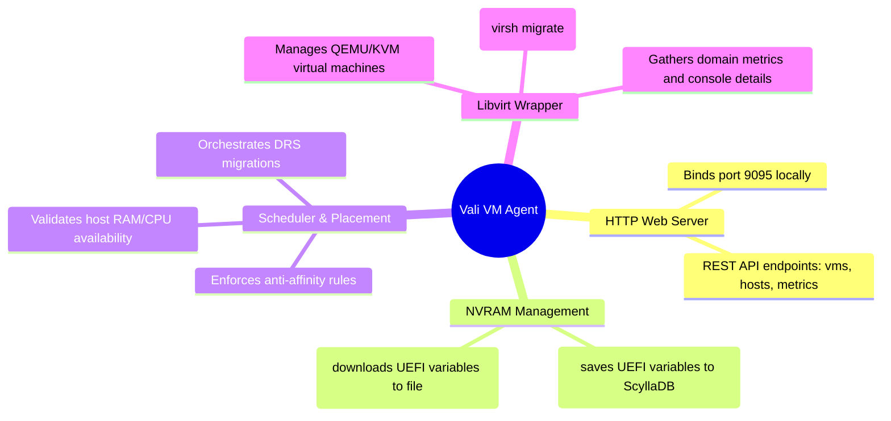

# Vali (VM Scheduler/Agent) - Technical Documentation

This document details the internal technical structure, functions, flowcharts, and mindmaps of the Vali hypervisor scheduling and management agent (`vali.py`).

## Technical Mindmap

## Function & Logic Breakdown

### mTLS Command Routing
- **`run_remote_spark(ip, command)`**: Executes remote system configurations using Spark's port `9099` mTLS execution API.
- **`run_mtls_spark_api(ip, path, payload, method="POST")`**: directly interacts with Spark daemon API endpoints.

### NVRAM Management
- **`get_nvram_backup_cmd(vm_name, delete_local=False)`**: Returns a python wrapper script block that reads the guest UEFI variables file (`/var/lib/hci/aether/nvram/<vm>_vars.fd`), encodes it as base64, and inserts it into `hydra.vm_nvram` in ScyllaDB.
- **`get_nvram_restore_cmd(vm_name)`**: Returns a python wrapper script block that queries `hydra.vm_nvram` for the guest's base64 UEFI metadata, decodes it, and writes it back to `/var/lib/hci/aether/nvram/<vm>_vars.fd` (falls back to copying the template `OVMF_VARS.fd` if no record exists).

### API Server (`ValiAPIHandler`)
- Binds standard `HTTPServer` on port `9095`.
- Implements endpoints:
  - **`GET /api/v1/hosts`**: Reports host system load, memory details, and hypervisor daemon states.
  - **`POST /api/v1/host/maintenance`**: Initiates host maintenance mode (`action="enter"` or `action="leave"`):
    - `enter`: Triggers DRS scheduler to migrate all running virtual machines from the target host to surviving nodes.
    - `leave`: Transitions node state to `NORMAL`, allowing VMs to be scheduled back.

### VM Lifecycle & Libvirt Orchestration
- Wraps libvirt controls:
  - **VM Creation**: Registers QEMU XML templates, configures virtual disks, and restores NVRAM variables.
  - **VM Destruction**: Purges guest instances and deletes storage volumes.
  - **Live Migration**: Executes:
    `virsh migrate --live --undefinesource --persistent qemu+ssh://root@<target_ip>/system`
    Updates database host bindings on success.
