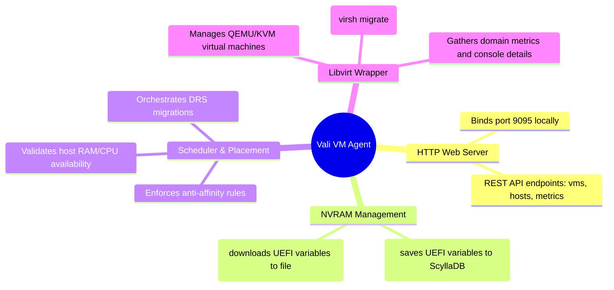

# Vali (VM Scheduler/Agent) - Technical Documentation

This document details the internal technical structure, functions, flowcharts, and mindmaps of the Vali hypervisor scheduling and management agent (`vali.py`).

## Technical Mindmap


```mermaid
mindmap
  root((Vali VM Agent))
    HTTP Web Server
      Binds port 9095 locally
      REST API endpoints: vms, hosts, metrics
    NVRAM Management
      get_nvram_backup_cmd (saves UEFI variables to ScyllaDB)
      get_nvram_restore_cmd (downloads UEFI variables to file)
    Scheduler & Placement
      Enforces anti-affinity rules
      Validates host RAM/CPU availability
      Orchestrates DRS migrations
    Libvirt Wrapper
      Manages QEMU/KVM virtual machines
      Coordinates live migration (virsh migrate)
      Gathers domain metrics and console details
```

## Function & Logic Breakdown

### mTLS Command Routing
- **`run_remote_spark(ip, command)`**: Executes remote system configurations using Spark's port `9099` mTLS execution API.
- **`run_mtls_spark_api(ip, path, payload, method="POST")`**: directly interacts with Spark daemon API endpoints.

### NVRAM Management
- **`get_nvram_backup_cmd(vm_name, delete_local=False)`**: Returns a python wrapper script block that reads the guest UEFI variables file (`/var/lib/hci/aether/nvram/<vm>_vars.fd`), encodes it as base64, and inserts it into `hydra.vm_nvram` in ScyllaDB.
- **`get_nvram_restore_cmd(vm_name)`**: Returns a python wrapper script block that queries `hydra.vm_nvram` for the guest's base64 UEFI metadata, decodes it, and writes it back to `/var/lib/hci/aether/nvram/<vm>_vars.fd` (falls back to copying the template `OVMF_VARS.fd` if no record exists).

### API Server (`ValiAPIHandler`)
- Binds standard `HTTPServer` on port `9095`.
- Implements endpoints:
  - **`GET /api/v1/hosts`**: Reports host system load, memory details, and hypervisor daemon states.
  - **`POST /api/v1/host/maintenance`**: Initiates host maintenance mode (`action="enter"` or `action="leave"`):
    - `enter`: Triggers DRS scheduler to migrate all running virtual machines from the target host to surviving nodes.
    - `leave`: Transitions node state to `NORMAL`, allowing VMs to be scheduled back.

### VM Lifecycle & Libvirt Orchestration
- Wraps libvirt controls:
  - **VM Creation**: Registers QEMU XML templates, configures virtual disks, and restores NVRAM variables.
  - **VM Destruction**: Purges guest instances and deletes storage volumes.
  - **Live Migration**: Executes:
    `virsh migrate --live --undefinesource --persistent qemu+ssh://root@<target_ip>/system`
    Updates database host bindings on success.

### Starting a VM attaches everything the domain names

The domain XML addresses storage as NBD exports on unix sockets, and a Sidon vdisk has no
socket until it is attached. So the start path in `process_queue_task` attaches before it
defines the domain, and what it attaches has to be *everything the XML names* — not just
the VM's own disks.

| Referenced by the XML | Attached by | Detached |
| --- | --- | --- |
| Data disks, `vdisk_id_for(vm, idx)` | the start path, checked, rolled back on failure | on VM stop / migrate-away |
| Images, `image_vdisk_id(iso_spec)` | the start path, checked | never automatically |

Images are the case that was missing. An image is an ordinary vdisk written once and then
sealed, and `op_seal` detaches it — deliberately, since an immutable vdisk should not keep
the writer's attachment. An image is therefore **always detached at rest**, and nothing
re-attached it at boot. Every VM with an ISO failed with:

```
Cannot access storage file '/var/lib/hci/sidon/nbd/img-<slug>.sock': No such file or directory
```

which reads as a missing file rather than an unattached disk, and made installing any
guest OS impossible.

Two rules follow from images being shared and immutable:

* **A failed image attach rolls back the data disks and not the images.** Attach is
  idempotent, which is what lets several guests mount the same ISO. Detaching one to tidy
  up after a failure would eject a disc from a VM that is running fine.
* **Nothing detaches an image on stop**, for the same reason. The cost is a socket.

The CD-ROM element itself was also a DRBD leftover: under DRBD an image really was a block
device at `/dev/drbd/by-res/img-<slug>/0`, so it was emitted as `type='block'` with
`<source dev=...>`. The path was later changed to a Sidon socket and the device type was
not, and qemu cannot open a unix socket as a block device. `helios_sidon.cdrom_xml()` now
emits the same `type='network'` NBD-over-unix shape as `disk_xml()`, read-only.

`helios_sidon.image_vdisk_id()` is the single definition of an image's vdisk id. There
were three — upload's, the start path's, and an inline copy in `vali.py` — and a
disagreement between them does not fail loudly: it points a guest at a vdisk nobody
created. `test_image_boot.py` asserts they still agree.
