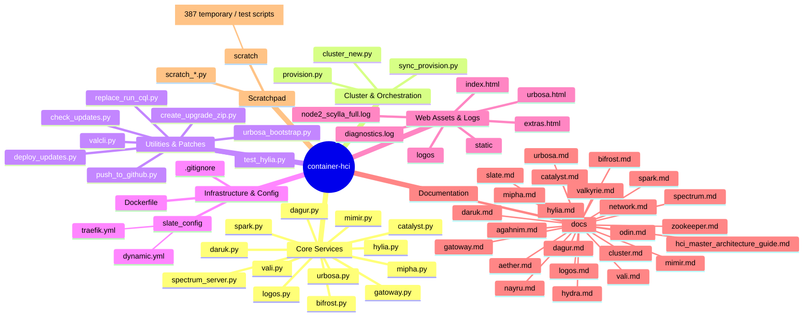

# Helios-HCI Workspace File Mindmap

This document provides a mindmap of all files and directories in the Helios-HCI workspace (`container-hci`).

```mermaid
mindmap
  root((container-hci))
    Core Services
      bifrost.py
      catalyst.py
      dagur.py
      daruk.py
      gatoway.py
      hylia.py
      logos.py
      mimir.py
      mipha.py
      spark.py
      spectrum_server.py
      urbosa.py
      vali.py
    Cluster & Orchestration
      cluster_new.py
      provision.py
      sync_provision.py
    Utilities & Patches
      check_updates.py
      create_upgrade_zip.py
      deploy_updates.py
      push_to_github.py
      replace_run_cql.py
      urbosa_bootstrap.py
      valcli.py
      test_hylia.py
    Infrastructure & Config
      Dockerfile
      slate_config
        dynamic.yml
        traefik.yml
      .gitignore
    Web Assets & Logs
      index.html
      extras.html
      urbosa.html
      static
      logos
      diagnostics.log
      node2_scylla_full.log
    Documentation
      docs
        aether.md
        agahnim.md
        bifrost.md
        catalyst.md
        cluster.md
        dagur.md
        daruk.md
        gatoway.md
        hci_master_architecture_guide.md
        hydra.md
        hylia.md
        logos.md
        mimir.md
        mipha.md
        nayru.md
        network.md
        odin.md
        slate.md
        spark.md
        spectrum.md
        urbosa.md
        vali.md
        valkyrie.md
        zookeeper.md
    Scratchpad
      scratch
        [387 temporary / test scripts]
      scratch_*.py
```
